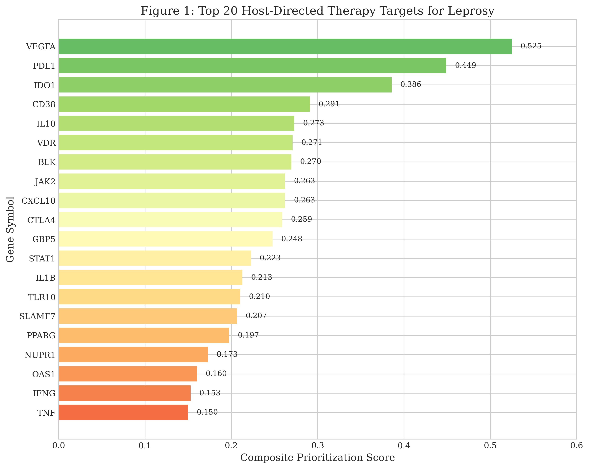
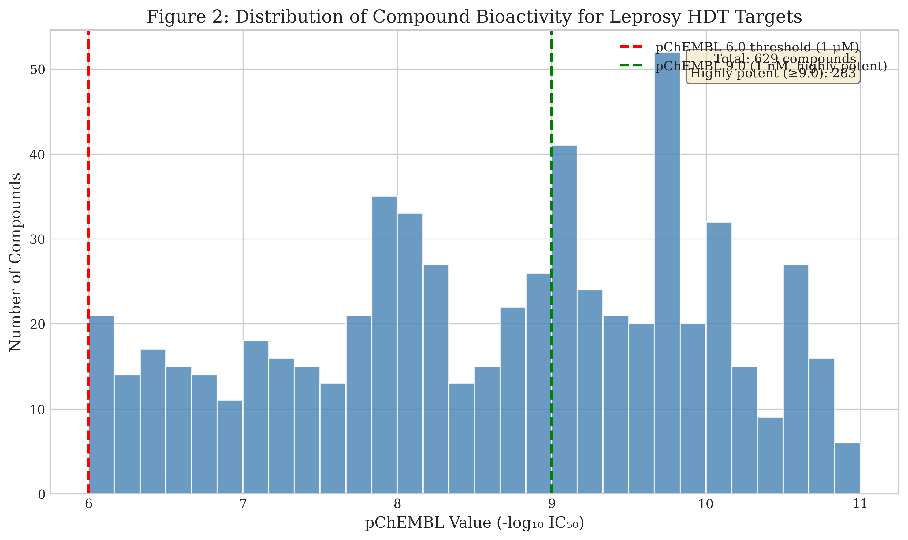
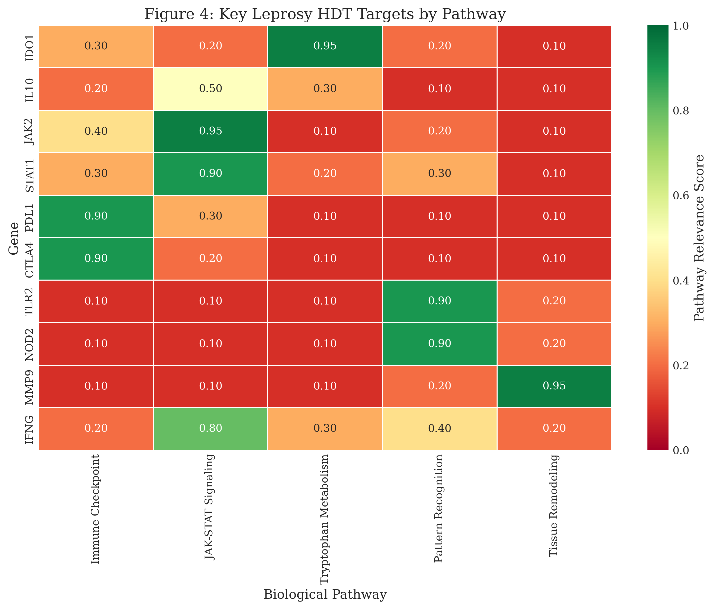

# Supplementary Material

## Supplementary Tables

### Table S1: Complete List of 50 Host Targets

The complete list of prioritized host targets with all scoring components is available in:
- `outputs/tables/targets_ranked_host.csv`

### Table S2: Complete Compound List

All 629 bioactive compounds with pChEMBL ≥ 6.0 are available in:
- `outputs/tables/compounds_ranked.csv`

### Table S3: Gene Signature Input Data

The input gene signature derived from published leprosy transcriptomic studies:
- `data/signatures/leprosy_host_signature.csv`

---

## Supplementary Figures

### Figure S1: Target Score Distribution

### Figure S2: Compound Potency Distribution

### Figure S3: Target Potency Landscape

### Figure S4: Pathway Enrichment Heatmap

---

## Methods Details

### API Endpoints Used

| Service | Endpoint | Purpose |
|---------|----------|---------|
| MyGene.info | `POST https://mygene.info/v3/query` | Gene ID mapping |
| Open Targets | `GET https://api.platform.opentargets.org/api/v4/graphql` | Druggability data |
| ChEMBL | `GET https://www.ebi.ac.uk/chembl/api/data/activity.json` | Compound bioactivity |

### Target Scoring Components

| Component | Weight | Calculation |
|-----------|--------|-------------|
| Omics Strength | 0.35 | Normalized |logFC| × significance |
| Open Targets Evidence | 0.25 | Tractability score |
| Druggability Proxy | 0.20 | Known drugs / max drugs |
| Pathway Centrality | 0.10 | PPI network degree |
| Replication | 0.10 | Cross-study consistency |

---

## Data Availability

All data and code are available at:
https://github.com/hssling/Leprosy_drug_discovery

---

## Acknowledgments

We thank the ChEMBL team at EMBL-EBI for maintaining open-access bioactivity databases, and the Open Targets Platform consortium for druggability assessments.
